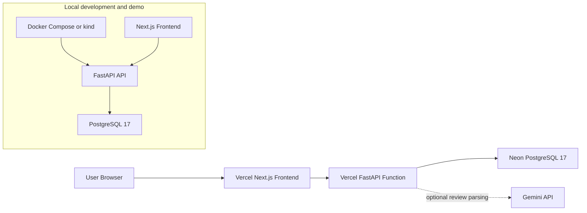

# Matcha Scout

AI-powered matcha discovery app that turns free-text reviews into taste profiles and ranks cafe drinks against a user's preferences.

> Sample data notice: all cafe names, drink names, prices, and descriptions are fictional and for demonstration only.

## Live Demo

- Frontend: [https://matcha-scout.vercel.app](https://matcha-scout.vercel.app)
- Help review verified drinks: [https://matcha-scout.vercel.app/review](https://matcha-scout.vercel.app/review)
- API: [https://matcha-scout-api.vercel.app](https://matcha-scout-api.vercel.app)
- API health check: [https://matcha-scout-api.vercel.app/health](https://matcha-scout-api.vercel.app/health)

## What It Does

Matcha Scout helps people find matcha drinks that fit how they actually like matcha: strong or mild, sweet or unsweetened, creamy or clean, earthy or mellow. Users can browse cafe drinks, take a preference quiz, receive explainable recommendations, and submit natural-language reviews. Exact drinks and reviews are user-submitted; taste profiles and confidence scoring are computed from Matcha Scout community reviews only (not Yelp ratings). Reviews are parsed into structured taste dimensions using Gemini; the deployed backend currently defaults to safe mock parsing.

### API endpoints

| Endpoint | Description |
|---|---|
| `GET /cafes` | List all cafes |
| `GET /cafes/{id}` | Cafe detail |
| `GET /cafes/{id}/drinks` | Drinks at a cafe |
| `POST /cafes/{id}/drinks` | Submit a user-added drink |
| `POST /cafes/{id}/drinks-with-review` | Submit drink + first review together |
| `GET /drinks/review-targets` | Read-only queue of verified drinks that need Matcha Scout reviews |
| `GET /drinks/{id}/taste-profile` | Taste profile with confidence label/score |
| `GET /recommendations?...` | Ranked matches with confidence fields |

## Why It Is Interesting

- Combines a product-style frontend with a real deployed serverless backend.
- Uses AI for structured review parsing, then keeps recommendations deterministic and explainable.
- Models cafe/drink/review/taste-profile data in PostgreSQL 17 with a temporary
  JSONB compatibility layer for the original DynamoDB access patterns.
- Includes Docker Compose local development plus a verified local Kubernetes demo with kind.
- Targets a zero-cost hobby deployment using Vercel Functions and Neon Postgres.

## Tech Stack

| Area | Stack |
|---|---|
| Frontend | Next.js 16 App Router, React 19, TypeScript, Tailwind CSS |
| Backend | FastAPI, Python, Pydantic |
| AI | Gemini structured-output parsing supported, mock parser for safe/default operation |
| Database | PostgreSQL 17 locally, Neon Postgres target; legacy DynamoDB adapter retained temporarily |
| Cloud | Vercel frontend + FastAPI Functions, Neon Postgres |
| DevOps | Docker Compose, Dockerfiles; historical AWS SAM and local kind manifests retained |
| Validation | pytest backend tests, ESLint, Next.js production build, curl smoke tests |

## Architecture



Production Kubernetes is intentionally not used. Kubernetes manifests are local-only for learning and demo purposes.

## Key Features

- Preference quiz across five taste dimensions.
- Explainable recommendation scoring with match percentages and reasons.
- Preference quiz across five taste dimensions.
- Explainable recommendation scoring with match percentages and reasons.
- Browse page with search, filters, sorting, cafe names, and drink cards.
- Cafe directory with Yelp source badges, ratings, and per-cafe drink listings.
- User-submitted drinks: anonymous users can add exact drinks they tried at a real cafe.
- Review queue for admin-verified drinks with low or unrated Matcha Scout confidence, including region filtering and direct links to review forms.
- Confidence scoring: taste profiles are rated Unrated / Low / Medium / High based on Matcha Scout review count — never Yelp ratings. See [docs/user-submitted-drinks.md](docs/user-submitted-drinks.md).
- Drink detail page with taste profile bars, confidence badge, review history, and review submission.
- AI parsing flow for natural-language reviews into structured taste ratings.
- Multi-region support (production live): San Diego and Orange County with a region picker on /cafes and /quiz. Browser geolocation is intentionally deferred until real users exist — manual region selection is used. Production region filters are live; production SD/OC cafe ingestion is a separate future phase. See [docs/regions-and-location.md](docs/regions-and-location.md).
- Local/admin ingestion for San Diego and Orange County via official Yelp Fusion API (multi-city OC search with deduplication).
- Manual drink curation workflow: `data/curation/` JSON files + `python -m app.ingest.manual_drink_curation` for admin-verified drinks. See [docs/manual-drink-curation.md](docs/manual-drink-curation.md).
- Fictional seed dataset with 5 cafes, 10 drinks, and baseline taste profiles.
- Local Docker Compose setup for API + PostgreSQL 17.
- Local kind Kubernetes workflow verified end to end.

## Screenshots

Screenshots live in [docs/screenshots](docs/screenshots/).

| View | Screenshot |
|---|---|
| Landing page | [landing-page.jpg](docs/screenshots/landing-page.jpg) |
| Quiz page | [quiz-page.jpg](docs/screenshots/quiz-page.jpg) |
| Recommendations | [recommendations-results.jpg](docs/screenshots/recommendations-results.jpg) |
| Browse drinks | [browse-drinks.jpg](docs/screenshots/browse-drinks.jpg) |
| Drink detail + review form | [drink-detail-review-form.jpg](docs/screenshots/drink-detail-review-form.jpg) |

## Run Locally

### Prerequisites

- Docker Desktop
- Node.js 20+

### Backend with Docker Compose

```bash
cp .env.example .env
docker compose up --build -d
docker compose exec api python -m app.seed.create_tables
docker compose exec api python -m app.seed.seed_data
curl http://localhost:8000/health
```

The local API runs at `http://localhost:8000`. PostgreSQL data persists in the
`matcha-postgres-data` Docker volume.

### Frontend

```bash
cd frontend
cp .env.example .env.local
npm install
npm run dev
```

Visit `http://localhost:3000`.

## Deployment Status

- Previous AWS backend: offline because the AWS account expired.
- Replacement backend: live on Vercel Functions at [matcha-scout-api.vercel.app](https://matcha-scout-api.vercel.app) with Neon PostgreSQL 17.
- Vercel frontend: live at [matcha-scout.vercel.app](https://matcha-scout.vercel.app) and connected to the replacement API.
- Local Kubernetes: manifests under [k8s/local](k8s/local/) verified with kind. See [docs/local-kubernetes.md](docs/local-kubernetes.md).
- Yelp ingestion: official Yelp Fusion API only, local/admin script only. See [docs/yelp-ingestion.md](docs/yelp-ingestion.md).
- Migration guide: [docs/postgres-migration.md](docs/postgres-migration.md).

## Testing

```bash
# Backend tests
docker compose exec api pytest tests/ -v

# Frontend lint and build
cd frontend
npm run lint
npm run build
```

Production smoke checks:

```bash
curl -I https://matcha-scout.vercel.app
curl -I https://matcha-scout.vercel.app/drinks
curl https://matcha-scout-api.vercel.app/health
curl https://matcha-scout-api.vercel.app/drinks
```

## API Overview

```bash
GET  /health
GET  /cafes
GET  /cafes/{id}
GET  /drinks
GET  /drinks/review-targets
GET  /drinks/{id}
GET  /drinks/{id}/taste-profile
GET  /drinks/{id}/reviews
POST /reviews
GET  /recommendations
```

Example recommendation request:

```bash
curl "http://localhost:8000/recommendations?matcha_strength=5&sweetness=2&creaminess=3&earthiness=5&bitterness=3&price_max=8&milk_type=oat&limit=5"
```

## Project Structure

```text
matcha-scout/
├── backend/              # FastAPI app, routers, models, services, seed scripts, tests
├── frontend/             # Next.js App Router frontend
├── infra/aws/            # Historical SAM deployment files
├── k8s/local/            # Local-only kind Kubernetes manifests
├── docs/                 # Deployment docs, showcase material, screenshots
├── scripts/              # Local Kubernetes helper script
└── docker-compose.yml
```

## Portfolio Docs

- [Project showcase](docs/project-showcase.md)
- [Resume bullets](docs/resume-bullets.md)
- [Launch copy](docs/launch-copy.md)
- [Review collection guide](docs/review-collection.md)
- [Share kit](docs/share-kit.md)
- [Launch QA checklist](docs/launch-qa-checklist.md)
- [Roadmap](docs/roadmap.md)
- [Yelp ingestion guide](docs/yelp-ingestion.md)
- [Local Kubernetes guide](docs/local-kubernetes.md)

## Resume Snapshot

- Built an AI-powered recommendation app with Next.js, FastAPI, PostgreSQL, Vercel, and Neon-compatible persistence.
- Implemented Gemini-compatible structured review parsing plus a deterministic ranking engine with explainable match percentages.
- Added production and local DevOps workflows, including Docker Compose and verified kind Kubernetes manifests.

## Notes

- All sample cafe/drink data is fictional.
- The deployed backend uses mock AI mode by default for safety and cost control.
- Kubernetes is local-only; the replacement production target is Vercel + Neon.
- Yelp data is external cafe metadata/excerpts only; it is not stored as Matcha Scout user reviews.
