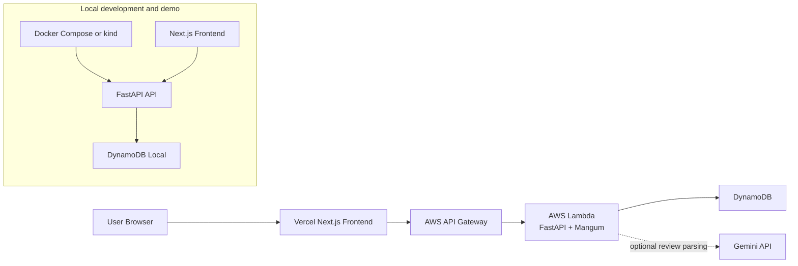

# Matcha Scout

AI-powered matcha discovery app that turns free-text reviews into taste profiles and ranks cafe drinks against a user's preferences.

> Sample data notice: all cafe names, drink names, prices, and descriptions are fictional and for demonstration only.

## Live Demo

- Frontend: [https://matcha-scout.vercel.app](https://matcha-scout.vercel.app)
- API: [https://2bd8jfknuc.execute-api.us-west-2.amazonaws.com](https://2bd8jfknuc.execute-api.us-west-2.amazonaws.com)
- API health check: [https://2bd8jfknuc.execute-api.us-west-2.amazonaws.com/health](https://2bd8jfknuc.execute-api.us-west-2.amazonaws.com/health)

## What It Does

Matcha Scout helps people find matcha drinks that fit how they actually like matcha: strong or mild, sweet or unsweetened, creamy or clean, earthy or mellow. Users can browse fictional cafe drinks, take a preference quiz, receive explainable recommendations, and submit natural-language reviews. Reviews can be parsed into structured taste dimensions using Gemini, while the deployed backend currently defaults to safe mock parsing.

## Why It Is Interesting

- Combines a product-style frontend with a real deployed serverless backend.
- Uses AI for structured review parsing, then keeps recommendations deterministic and explainable.
- Models cafe/drink/review/taste-profile data in DynamoDB with local and production paths.
- Includes Docker Compose local development plus a verified local Kubernetes demo with kind.
- Keeps production cost-conscious: Lambda, API Gateway, and DynamoDB instead of EKS, RDS, EC2, or NAT Gateway.

## Tech Stack

| Area | Stack |
|---|---|
| Frontend | Next.js 16 App Router, React 19, TypeScript, Tailwind CSS |
| Backend | FastAPI, Python, Pydantic, Mangum |
| AI | Gemini structured-output parsing supported, mock parser for safe/default operation |
| Database | DynamoDB in AWS, DynamoDB Local for local Docker/kind workflows |
| Cloud | Vercel frontend, AWS Lambda, API Gateway HTTP API, DynamoDB |
| DevOps | Docker Compose, Dockerfiles, AWS SAM, kind, Kubernetes manifests |
| Validation | pytest backend tests, ESLint, Next.js production build, curl smoke tests |

## Architecture



Production Kubernetes is intentionally not used. Kubernetes manifests are local-only for learning and demo purposes.

## Key Features

- Preference quiz across five taste dimensions.
- Explainable recommendation scoring with match percentages and reasons.
- Browse page with search, filters, sorting, cafe names, and drink cards.
- Drink detail page with taste profile bars, review history, and review submission.
- AI parsing flow for natural-language reviews into structured taste ratings.
- Local/admin ingestion for real San Diego cafe metadata through the official Yelp Fusion API.
- Fictional seed dataset with 5 cafes, 10 drinks, and baseline taste profiles.
- Local Docker Compose setup for API + DynamoDB Local.
- Local kind Kubernetes workflow verified end to end.

## Screenshots

Screenshots live in [docs/screenshots](docs/screenshots/).

| View | Screenshot |
|---|---|
| Landing page | [landing-page.jpg](docs/screenshots/landing-page.jpg) |
| Quiz page | [quiz-page.jpg](docs/screenshots/quiz-page.jpg) |
| Recommendations | [recommendations-results.jpg](docs/screenshots/recommendations-results.jpg) |
| Browse drinks | [browse-drinks.jpg](docs/screenshots/browse-drinks.jpg) |
| Drink detail + review form | [drink-detail-review-form.jpg](docs/screenshots/drink-detail-review-form.jpg) |

## Run Locally

### Prerequisites

- Docker Desktop
- Node.js 20+

### Backend with Docker Compose

```bash
cp .env.example .env
docker compose up --build -d
docker compose exec api python -m app.seed.create_tables
docker compose exec api python -m app.seed.seed_data
curl http://localhost:8000/health
```

The local API runs at `http://localhost:8000`. DynamoDB Local runs inside Docker and resets when the container is recreated.

### Frontend

```bash
cd frontend
cp .env.example .env.local
npm install
npm run dev
```

Visit `http://localhost:3000`.

## Deployment Status

- AWS backend: deployed with SAM to Lambda + API Gateway + DynamoDB in `us-west-2`.
- Vercel frontend: deployed at [matcha-scout.vercel.app](https://matcha-scout.vercel.app).
- Local Kubernetes: manifests under [k8s/local](k8s/local/) verified with kind. See [docs/local-kubernetes.md](docs/local-kubernetes.md).
- Yelp ingestion: official Yelp Fusion API only, local/admin script only. See [docs/yelp-ingestion.md](docs/yelp-ingestion.md).

Cost-safety note: production uses serverless AWS services and does not use EKS, RDS, EC2, NAT Gateway, or other always-on infrastructure.

## Testing

```bash
# Backend tests
docker compose exec api pytest tests/ -v

# Frontend lint and build
cd frontend
npm run lint
npm run build
```

Production smoke checks:

```bash
curl -I https://matcha-scout.vercel.app
curl -I https://matcha-scout.vercel.app/drinks
curl https://2bd8jfknuc.execute-api.us-west-2.amazonaws.com/health
curl https://2bd8jfknuc.execute-api.us-west-2.amazonaws.com/drinks
```

## API Overview

```bash
GET  /health
GET  /cafes
GET  /cafes/{id}
GET  /drinks
GET  /drinks/{id}
GET  /drinks/{id}/taste-profile
GET  /drinks/{id}/reviews
POST /reviews
GET  /recommendations
```

Example recommendation request:

```bash
curl "http://localhost:8000/recommendations?matcha_strength=5&sweetness=2&creaminess=3&earthiness=5&bitterness=3&price_max=8&milk_type=oat&limit=5"
```

## Project Structure

```text
matcha-scout/
├── backend/              # FastAPI app, routers, models, services, seed scripts, tests
├── frontend/             # Next.js App Router frontend
├── infra/aws/            # SAM template for Lambda/API Gateway/DynamoDB
├── k8s/local/            # Local-only kind Kubernetes manifests
├── docs/                 # Deployment docs, showcase material, screenshots
├── scripts/              # Local Kubernetes helper script
└── docker-compose.yml
```

## Portfolio Docs

- [Project showcase](docs/project-showcase.md)
- [Resume bullets](docs/resume-bullets.md)
- [Launch copy](docs/launch-copy.md)
- [Roadmap](docs/roadmap.md)
- [Yelp ingestion guide](docs/yelp-ingestion.md)
- [Local Kubernetes guide](docs/local-kubernetes.md)

## Resume Snapshot

- Built and deployed an AI-powered recommendation app with Next.js, FastAPI, DynamoDB, AWS Lambda/API Gateway, and Vercel.
- Implemented Gemini-compatible structured review parsing plus a deterministic ranking engine with explainable match percentages.
- Added production and local DevOps workflows, including Docker Compose and verified kind Kubernetes manifests.

## Notes

- All sample cafe/drink data is fictional.
- The deployed backend uses mock AI mode by default for safety and cost control.
- Kubernetes is local-only; production remains Vercel + AWS serverless.
- Yelp data is external cafe metadata/excerpts only; it is not stored as Matcha Scout user reviews.
